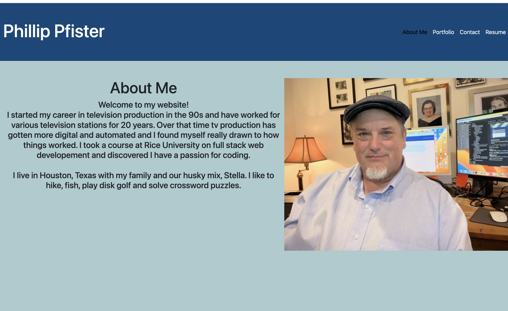
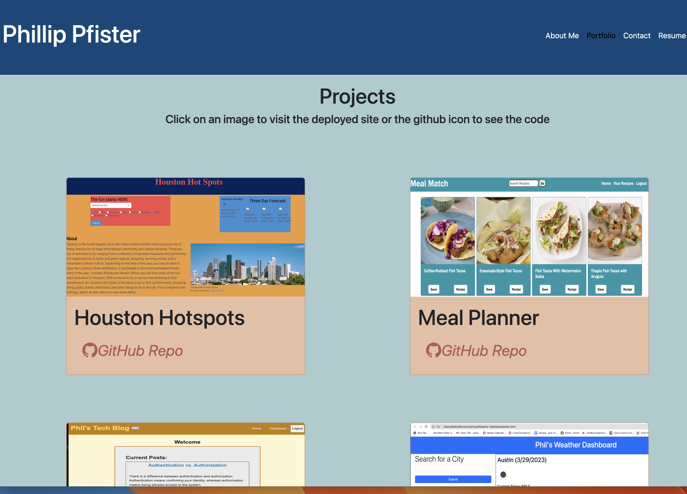
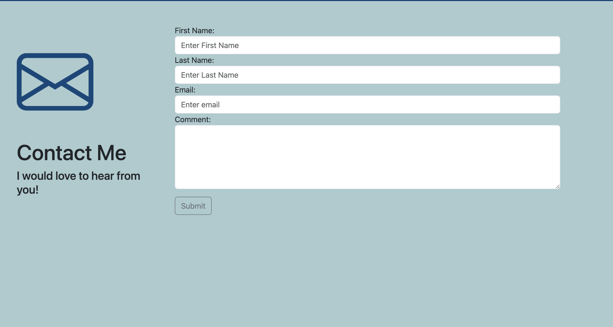
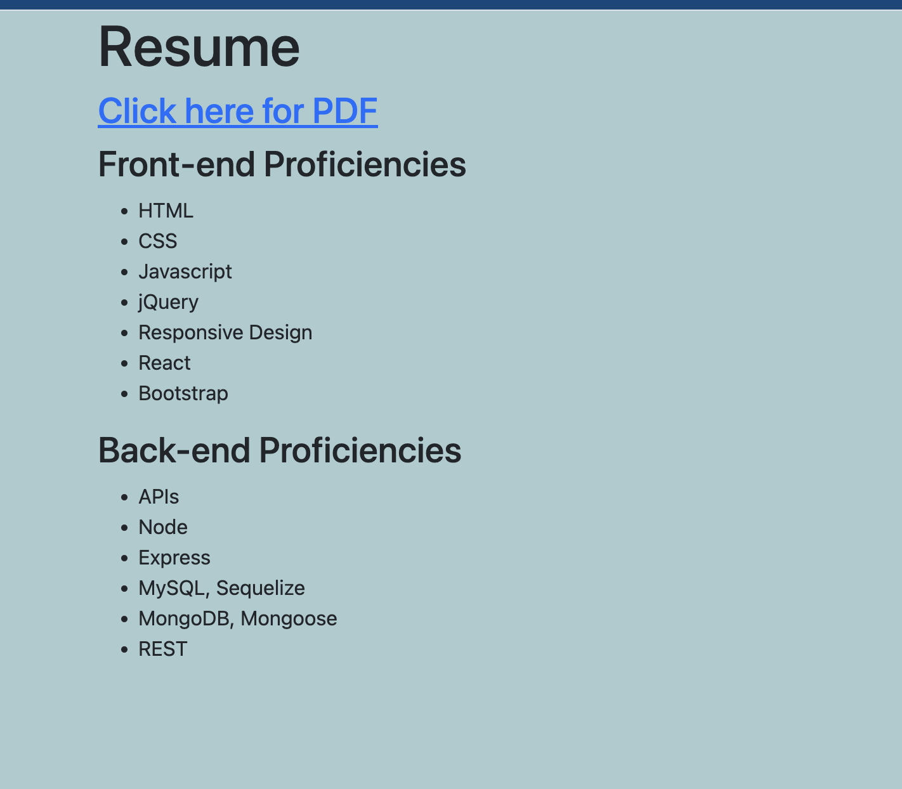

# React-Portfolio-Pfister

---

## Badges

---

## Table of Contents

---

- [Description](#description)
- [Usage](#usage)
- [Installation](#installation)
- [Contributing](#credits)
- [Links](#links-and-screenshots)
- [License](#license)

## Description

---

This application is a portfolio page built using React. It has four sections that include an about link, a contact link a portfolio link and a resume link.

## Usage

---

Navigate to the home page and view the various links

## Installation

---

Fork the repo and install on your local machine. Run `npm i` to install the dependencies and `npm start` to start the app.

## Credits

---

This app was created by Phillip Pfister as a project for the Rice University Fullstack coding bootcamp.

## Links and Screenshots

---

Visit the deployed website here [https://phil-pfister.github.io/React-Portfolio-Pfister/](https://phil-pfister.github.io/React-Portfolio-Pfister/)

### About Page

### Portfolio Page

### Contact Form

### Resume Page

## Contact Information

---

### Github: [Phillip Pfister](https://github.com/Phil-Pfister)

### Email: salshouse@gmail.com

## License

---

This application uses the The Unlicense license
